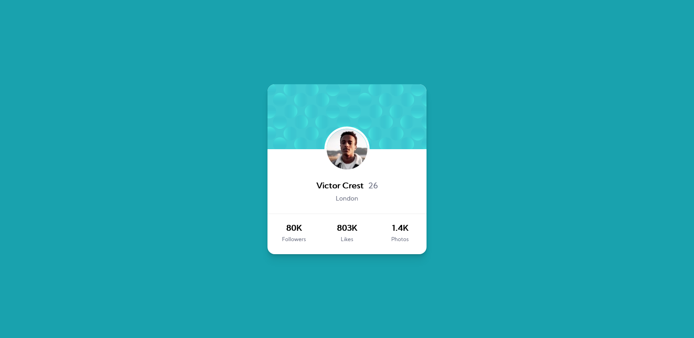

# Frontend Mentor - Profile Card Component Solution

This is a solution to the [Profile Card Component challenge on Frontend Mentor](https://www.frontendmentor.io/challenges/profile-card-component-cfArpWshJ). Frontend Mentor challenges help you improve your coding skills by building realistic projects.

## Table of contents

- [Overview](#overview)
  - [The challenge](#the-challenge)
  - [Screenshot](#screenshot)
  - [Links](#links)
- [My process](#my-process)
  - [Built with](#built-with)
  - [What I learned](#what-i-learned)
  - [Continued development](#continued-development)
- [Author](#author)

## Overview

### The challenge

The [challenge](https://www.frontendmentor.io/challenges/profile-card-component-cfArpWshJ) was to build out the profile card component and get it looking as close to the design as possible.

Users should be able to:

- View the optimal layout for the component depending on their device's screen size.

### Screenshot

### Links

- Solution URL: TBA
- Live Site URL: [Here](https://likelytwitchdollop.github.io/profile-card-component/)

## My process

### Built with

HTML5 + CSS | Flexbox | CSS Grid using a mobile-first workflow.

### What I learned

Major learnings while working on this project were:

- Responsive background images can be a bit tricky.
- Calling `margin-top` can move the affected element above the preceeding elements, if the value is sufficient.
- `overflow: hidden` is another good alternative to creating rounded corners on a `div` that contains other `div`s.

### Continued development

This solution is still a WIP, for the following reasons:

- There's a weird spacing around the profile picture and it's border.
- The solution is not elegantly translayed on a Galaxy Fold as the `@media` queries do not accommodate this use case.
- The background images are missing.

Attempting this challenge highlighted some areas I would like to continue perfecting:

- Creating responsive background images.

## Author

- Frontend Mentor - [@likelytwitchdollop](https://www.frontendmentor.io/profile/likelytwitchdollop)
